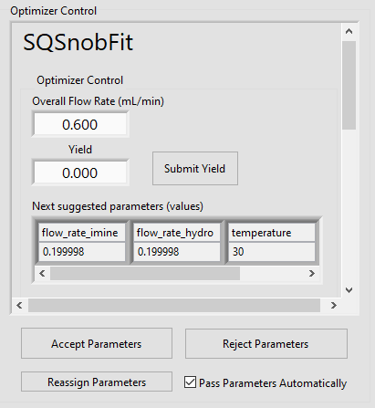
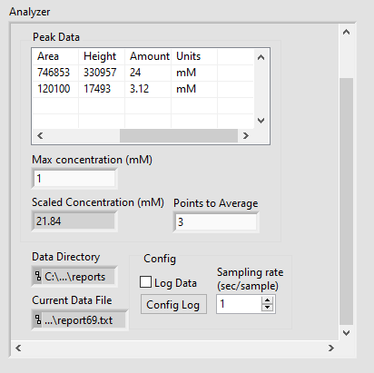

.. _mock-experiment:

Mock Experiment
===============

.. warning::
   
   This example experiment has only been tested on Windows 10 with LabVIEW 
   2020.

.. warning::
   
   Before attempting this tutorial, make sure you have read and performed the 
   necessary steps in the :ref:`installation` and :ref:`getting-started` 
   sections.

This is a mock experiment that can be run without using any hardware-specific 
plugins by using mock instrumentation. It is quite a long tutorial document,
so utilize the outline to the left for easier navigation between sections!

This tutorial will walk you through a basic optimization setup with Rxn Rover
with the following steps: 

| - Downloading plugins from the Rxn Rover Plugin Catalog,
| - Installing plugins in a place where Rxn Rover can find them,
| - Creating a new Experiment with Rxn Rover,
| - Loading plugins,
| - Configuring and running an Experiment, and
| - Where to find the results of an optimization.

.. _mock-experiment-download-plugins:

Downloading the Plugins
-----------------------

This tutorial uses four "mock" plugins from the Rxn Rover Plugin Catalog: a 
mock analyzer, a mock pump, and a mock temperature controller. It also uses
the plugin which connects SQSnobFit into Rxn Rover.

In a web browser, navigate to the `Rxn Rover Plugin Catalog 
<https://RxnRover.github.io/PluginCatalog>`__ (open it in a new tab). There
you will see sections for "First-Party Plugins" and "Third-Party Plugins"; we
will be retrieving first-party plugins for this tutorial, which are created by
the Rxn Rover team. 

The First-Party Plugins section is divided into "Plugin Classes" to help you 
find plugins which fulfill each role in the Rxn Rover workflow: Analyzers,
Optimizers, and Reactor Components.

Mock LC Analyzer
^^^^^^^^^^^^^^^^

The mock analyzer plugin we will be using generates random data as if it were
being generated and parsed from a liquid chromatograph (LC). The catalog entry
for this plugin can be found under ``First-Party Plugins >  Plugin Classes > 
Analyzers > Liquid Chromatography > Mock LC Parser``, where there will be 
acquisition instructions and a brief description of the plugin. Download the
repository by following the link in the acquisition section, clicking the green 
"Code" button in the top right of the Mock LC Parser repository, and selecting
"Download ZIP". Notice that these download instructions are also on the front 
page of the Mock LC Parser repository.

   
   Mock LC Parser repository showing the green "Code" button in the top right
   and the top of the installation instructions for the plugin at the bottom of
   the image.

Mock Pump
^^^^^^^^^

The mock pump plugin we will be using simulates a pump by changing flow rates
and generating pressure values when the pump is "running". The catalog entry
for this plugin can be found under ``First-Party Plugins > Plugin Classes > 
Reactor Components > Mock Pump``. This will be downloaded similarly to the Mock
LC Analyzer above.

Mock Temperature Controller
^^^^^^^^^^^^^^^^^^^^^^^^^^^

The mock temperature controller plugin we will be using simulates a temperature
controller by changing temperature setpoint and heating to the setpoint when it
is "running". The catalog entry for this plugin can be found under 
``First-Party Plugins > Plugin Classes > Reactor Components > Mock Pump``. This 
will be downloaded similarly to the Mock LC Analyzer above.

SQSnobFit Optimizer
^^^^^^^^^^^^^^^^^^^

The SQSnobFit optimizer plugin creates and connects to an instance of SQSnobFit
to perform a reaction optimization. In this mock experiment, it will only 
receive random numbers from the analyzer, but it will still try its best and 
provide new reaction parameters! The catalog entry for this plugin can be found 
under ``First-Party Plugins > Plugin Classes > Optimization and Control > Mock 
Pump``. Download this plugin similarly to the other plugins above.

.. _mock-experiment-install-plugins:

Installing Plugins
------------------

.. note::
   Plugin installation for this tutorial is fairly straightforward, but when 
   installing other plugins please remember to read the installation 
   instructions provided by the authors carefully!
   
To install the plugins acquired in :ref:`mock-experiment-download-plugins`, 
extract each ZIP file into the ``<documents>/RxnRover/Plugins`` directory, 
where ``<documents>`` is the current user's Documents directory.
(:ref:`missing-plugin-directories`)

.. _mock-experiment-create-experiment:

Creating the Mock Experiment
----------------------------

Run Rxn Rover and you will be presented with the Experiment Manager window. 
Notice all of the different forms for the name styles in the "Recent
Experiments". An Experiment can be named in using any convention, but cannot
contain symbols that are not allowed in a file name.

.. _mock-experiment-experiment-manager-window:

.. figure:: experiment_manager.png
   :alt: Screenshot of Experiment Manager window with example recent 
      experiments.
   :scale: 75%
   
   Experiment Manager window with example recent experiments.

Click the "Create New Experiment" button and fill in the information like in 
the image below. Choose an Experiment Location that will be easy to find in a
file explorer, like a directory on your Desktop or in your Documents. Press 
"OK" when you are finished.

.. _mock-experiment-new-experiment-window:

.. figure:: create_mock_experiment.png
   :alt: Screenshot of the "Create New Experiment" dialog with information for
      this mock experiment filled in.
   :scale: 75%
   
   Create New Experiment dialog with information for this mock experiment 
   filled in.

You should now be presented with a blank Rxn Rover window indicating your new
experiment name, location, and save status in the title bar. This is the main
window for Rxn Rover and almost all actions are taken from here.

.. _mock-experiment-rxnrover-blank:

.. figure:: rxnrover_blank.png
   :alt: Screenshot of a blank Rxn Rover main window with the mock experiment
      loaded.
   
   Create New Experiment dialog with information for this mock experiment 
   filled in.

.. note::
   
   For more information on the Experiment Manager and its usage, 
   see :ref:`experiment-manager`.

.. _mock-experiment-load-plugins:

Loading the Plugins
-------------------

Reactor Components
^^^^^^^^^^^^^^^^^^

First, we will load some Reactor Components. To do this, click the "Load
Controller" button in the top left. Enter information to match the image below.

.. _mock-experiment-load-hardware:

.. figure:: load_hardware.png
   :alt: Screenshot of "Select Hardware" window used to load and name Reactor
      Component plugin instances.
   
   Select Hardware window used to load and name Reactor Component plugin 
   instances.
   
Press "OK" and the plugin will start loading. The plugin will open a dialog 
window to connect the plugin to a hardware resource. Although no instruments
are connected, your computer should still have a COM port to select. Select 
this in the VISA Resource dropdown list now and "Connect". (Additional 
information: `What is VISA? <https://www.ni.com/en-us/support/documentation/
supplemental/06/ni-visa-overview.html>`__)

.. _mock-experiment-select-hardware:

.. figure:: select_hardware_resource.png
   :alt: Screenshot of VISA Resource selection window.
   
   VISA Resource selection window used to connect to physical hardware through
   a COM port.

.. note::
   The mock reactor component plugins used here simulate hardware that 
   connects through serial COM ports, although other connections like Ethernet 
   are possible. USB connections will commonly appear as "virtual" COM ports as
   well, so these mock plugins represent many hardware possibilities. When 
   downloading a plugin, consult the plugin author's instructions and 
   hardware user manual to connect the hardware to your computer 
   properly.

Load two more mock pumps named "Mock Pump 2" and "Mock Pump 3" using the same
mock pump plugin selection. Selecting the same plugin creates a new instance
of the plugin, so you do not need to worry about the plugins affecting one 
another. These new mock pumps can use the same VISA resource since we are using
a mock plugin, although that should be avoided with real plugins.

Load one mock temperature controller in the same manner as the mock pumps. The
main Rxn Rover window should now look like the image below. Notice that you can
switch between the full control panels of each plugin in the "Manual Control" 
section on the right.

.. _mock-experiment-rxnrover-manual-hardware-loaded:

.. figure:: rxnrover_hardware_loaded.png
   :alt: Screenshot of main Rxn Rover window with reactor components loaded and
      the Manual Control plugin list expanded.
   
   Main Rxn Rover window with reactor components loaded and the Manual Control
   plugin list expanded.

Optimizer
^^^^^^^^^

Press the "Load Optimizer" button to open the "Select Optimizer" window. Select
"SQSnobFit" from the list and press "OK". It does not matter if you name
the optimizer, as this name is not visible anywhere currently.

.. _mock-experiment-load-optimizer:

   
   Select Optimizer window used to load and name an Optimizer plugin.

Instead of a VISA Resource, this optimizer plugin requires a script that tells
it how to start SQSnobFit. Browse to ``<documents>/RxnRover/Plugins/SQSnobFit/
sqsnobfit_remote_optimizer/scripts/`` and select ``start_inference.bat``
(Windows) or ``start_inference.sh`` (Linux or Mac). When "Connect" is pressed, 
a terminal should open that is running the optimization algorithm. Minimize 
this terminal, but do not close it! If you accidentally close it, press "Stop
Optimizer" and restart this section.

.. _mock-experiment-select-optimizer-script-filled:

.. figure:: select_optimizer_script_filled.png
   :alt: Screenshot of Optimizer Start Script selection window.
   
   Optimizer Start Script selection window used to select a script to run the
   SQSnobFit optimization algorithm.

.. _mock-experiment-optimizer-terminal:

   
   Snippet of a command prompt window running the SQSnobFit script.

The Optimizer Control section of the Rxn Rover main window should now have the
SQSnobFit plugin loaded in it. Specify the overall flow rate as 0.6 mL/min and
click outside the text box for the change to take affect.

.. _mock-experiment-rxnrover-optimizer-loaded:

   
   Main Rxn Rover window optimizer control with SQSnobFit loaded.

Assigning Parameters
^^^^^^^^^^^^^^^^^^^^

A window to assign parameters to reactor components will either open 
automatically when an optimizer is loaded, or by pressing the "Reassign 
Parameters" button in the Optimizer Control section. Plugins are assigned to
parameters by dragging the plugin names from the "Unclassified" section to the 
desired parameter. Assign the mock reactor component plugins to the optimizer 
plugins as shown below.

.. _mock-experiment-reassign-parameters:

.. figure:: reassign_parameters_assigned.png
   :alt: Screenshot of parameter assignment window.
   
   Parameter assignment window with the mock plugins assigned to their 
   corresponding optimization parameters.

Once you have assigned the parameters, press "Accept Parameters" to manually
forward the initial parameters from the optimizer to the reactor components
and press "Start Hardware" so the components turn on (start pumping and 
heating). Afterward, check the "Pass Parameters Automatically" box. Once the
analyzer is loaded and passing reaction results to the optimizer, the 
optimizer will explore the space automatically.

Analyzer
^^^^^^^^

Press the "Load Analyzer" button to open the "Select Analyzer" window. Select
"Mock LC Parser" from the list and press "OK". It does not matter if you name
the analyzer, as this name is not visible anywhere currently.

.. _mock-experiment-load-analyzer:

.. figure:: load_analyzer.png
   :alt: Screenshot of "Select Analyzer" window.
   
   Select Analyzer window used to load and name an Analyzer plugin.

This plugin parses report files from an LC system, reading the concentration of
the analyte. Create a directory called "reports" in your Experiment Location
directory, created at the beginning of this tutorial and select it as the 
"Report Directory" when prompted by the plugin, similar to selecting a VISA 
resource in the mock reactor components or selecting a plugin for the 
optimizer. This "reports" directory could also be placed on your Desktop or 
in the Downloads folder, but by creating it in the Experiment Location, all
relevant data files for a given experiment are in the same place. This makes
referencing the data later easier.

When "Connect" is pressed, a terminal will open, running the report file 
generation script, which generates mock LC report files with random data every 
two seconds. Minimize this terminal, but do not close it! If you accidentally 
close it, press "Stop Analyzer" and restart this section.

.. _mock-experiment-select-analyzer-directory:

   
   Analyzer report directory selection window used to select a directory where
   the fake report files are output to and parsed from.

.. _mock-experiment-analyzer-command-prompt:

   
   Snippet of a command prompt window running the report generation script.

The Analyzer section of the Rxn Rover main window should now have the
Mock LC Parser plugin loaded in it. It will update when it parses each new 
report, averaging every three reports and sending the result to the optimizer.

.. _mock-experiment-rxnrover-analyzer-scrolled:

   
   Analyzer section of Rxn Rover with the Mock LC Parser loaded.

Stopping the Optimization
-------------------------

With reactor components, an optimizer, and an analyzer loaded, the automated
optimization should be under way! Let it run for a minute or two to gather some
"data". After that, stop the reactor components with "Stop Hardware" and close
the Rxn Rover window. You will also need to close the two terminals that were 
opened when the optimizer and analyzer plugins were loaded.

Finding your Data
-----------------

Once you complete an experiment with Rxn Rover, you can find data logs for each
of the plugins in the Experiment directory that you set when you created the 
Experiment. Each reactor component should log details about the 
state of the component, like the VISA resource used, the flow rate, 
pressure values, and when it was running vs. when it was not. The optimizer 
log is where a summary of the optimization steps can be found, including when
each step was started, the reaction conditions used, and the resulting yield
(which actually appears on the line **after** the corresponding conditions).
Since the analyzer was parsing from existing report files, no additonal log
files are written.

.. _mock-experiment-directory:

   
   Contents of the mock experiment directory at the end of this tutorial.