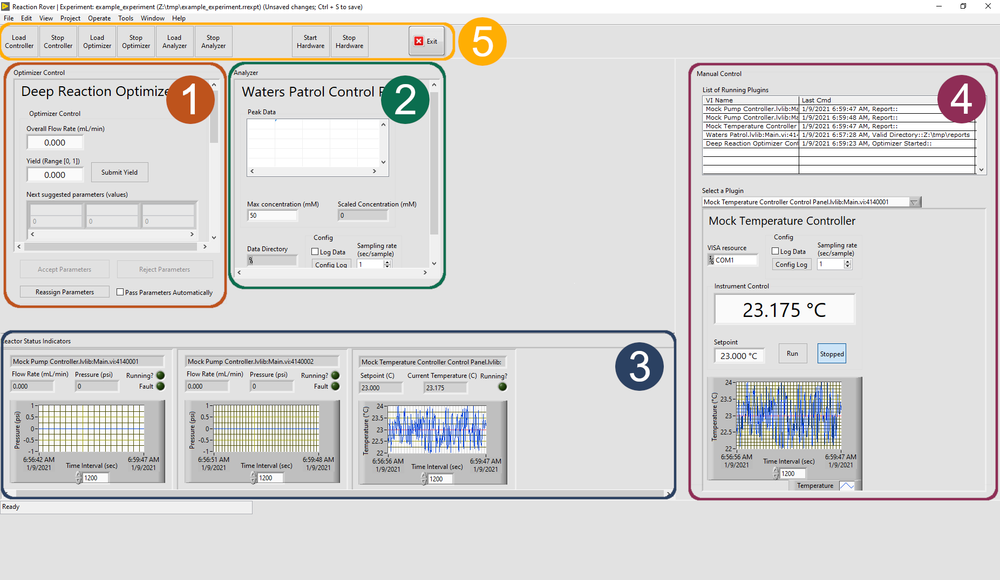
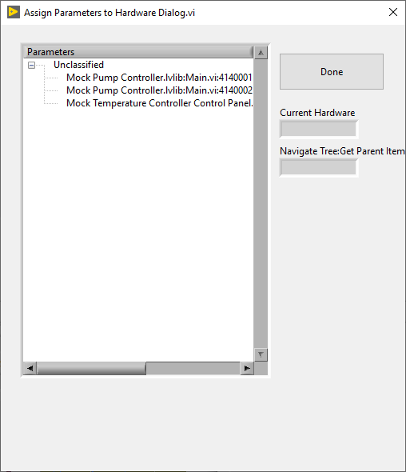

.. _rxnrover_basics:

Rxn Rover Basics
================

.. _rxnrover-ui:

User Interface
--------------

The Rxn Rover user interface (UI) is made up of five distinct areas: 
Optimizer Control, Analyzer, Reactor Status Indicators, Manual Control, and
Overall Experiment control.

.. _rxnrover-ui-window:

   
   Main UI of Rxn Rover.

.. _rxnrover-automated-workflow:

Basic Automated Workflow
------------------------

Rxn Rover is designed to allow automated optimization of chemical reactions,
providing an optimization algorithm with the power to control a reactor, 
perform reactions, and retrieve the results to choose the next optimization 
step. Basic operation of Rxn Rover for automated reaction optimization 
consists of the following steps:

#. Create or load an Experiment file.
#. Load reactor components with the :guilabel:`Load Controller` button in Overall 
   Experiment control.
#. Load an optimizer with the :guilabel:`Load Optimizer` button in Overall Experiment 
   control.
#. Associate optimizer parameters to reactor components by clicking :guilabel:`Reassign Parameters` button and going through the 
   "Reassign Parameters" dialog. See :ref:`reassign-parameters`.
#. Load an analyzer to parse data from analysis instrumentation with the :guilabel:`Load Analyzer` button in Overall Experiment control.
#. Configure plugin-specific options using the "Manual Control" section.
#. Click :guilabel:`Start Experiment` to start the reactor and begin collecting data.
#. Click :guilabel:`Stop Experiment` when it is complete and refer to the Experiment
   Location for data files.

.. _rxnrover-manual-workflow:

Manual Workflow
---------------

While the main goal of Rxn Rover is automated, algorithmic reactor control, 
it can also serve as a central reactor control when performing manual 
experiments. This can be especially useful if some reactor components are 
difficult to reach. Manual control setup is similar to :ref:`automated 
control <rxnrover-automated-workflow>` setup, but with less steps:

#. Create or load an Experiment file.
#. Load reactor components with the :guilabel:`Load Controller` button in Overall 
   Experiment control.
#. Configure plugin-specific options using the "Manual Control" section.
#. Click :guilabel:`Start Experiment` to start the reactor and begin collecting data.
#. Click :guilabel:`Stop Experiment` when it is complete and refer to the Experiment
   Location for data files.

.. _reassign-parameters:

Assigning Optimizer Parameters to Reactor Components
----------------------------------------------------

Assigning optimization parameters to reactor components can be an unintuitive
process to a new user. This section desribes how to make these assignments.

The :ref:`Reassign Parameters dialog <reassign-parameters-dialog>` is used to 
assign specific reactor components to optimizer parameters, which will change
reaction conditions accordingly. In the "Reassign Parameters" dialog, plugins
are assigned to paramters by dragging "Unclassified" plugins to one of the
listed parameters.

.. note::
   **Can't find the Reassign Parameters window?**
   
   The Reassign Parameters dialog will automatically appear after an 
   optimizer is loaded, or can be opened at any time by pressing the :guilabel:`Reassign Parameters` button in Optimizer Control.

.. _reassign-parameters-dialog:

   
   Reassign Parameters dialog window.

After dragging a plugin to a parameter, the plugin will be listed under the
parameter. Once you have assigned all parameters, press :guilabel:`Done` 

If you want to reassign parameters again or have made a mistake, you can repeat the steps above.